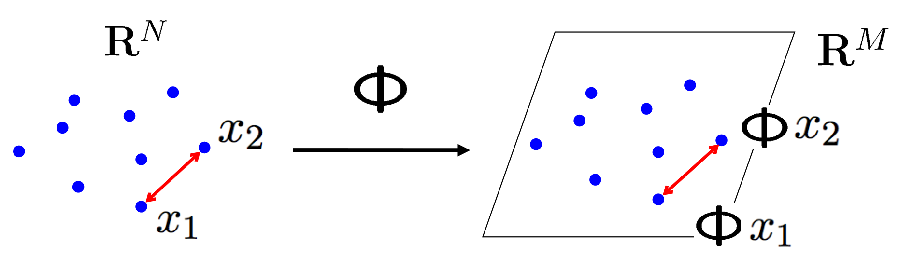

## Investigating the isometric behaviour of Neural Machine Translation models on binary semantic equivalence spaces

1. [Overview](#Overview-book)
2. [Dependencies](#Dependencies-neckbeard)
3. [Repository initialization](#Repository-initialization-fire)
4. [Usage](#Usage-cyclone)
    1. [Training](#i-Training)
    2. [Translation](#ii-Translation)
    3. [Evaluation](#iii-Evaluation)
    4. [Visualization](#iv-Visualization)
5. [References](#References-sweat_drops)
6. [Development](#Development-snail)

### Overview :book:

Isometry is defined mathematically as a distance-preserving transformation between two metric spaces. A simplified [illustration](https://slideplayer.com/slide/4659099/) of isometry in higher dimensional functional spaces can be seen below. In this research, we view Neural Machine Translation (NMT) models from the perspective of semantic isometry and assume that well-performing NMT models function approximately isometrically on semantic metric spaces. That is to say, if two sentences are semantically equivalent on the source side, they should remain semantically equivalent after translation on the target side given a well-performing NMT model. We hypothesize that the frequency of such semantically isometric behaviour correlates positively with general model performance. 

<p align="center">

</p>

We conduct our investigation by using two NMT models of varying performance to translate semantically-equivalent German paraphrases, based off diverse WMT19 test data [references](https://github.com/google/wmt19-paraphrased-references), to English. We use Facebook's FAIR WMT19 winning single model from [Ng. et al. (2019)](https://arxiv.org/abs/1907.06616) as our SOTA model. We train a large transformer model based on the Scaling NMT methodology from [Ott et al. (2018)](https://arxiv.org/abs/1806.00187) on WMT16 data and utilize this model as our non-SOTA model.

We simplify the notion of semantic metric spaces into probabilistic binary semantic equivalence spaces and compute these using three transformer language models fine-tuned on Google's [PAWS-X](https://github.com/google-research-datasets/paws/tree/master/pawsx) paraphrase detection task. We adapt our workflow from Google's [XTREME](https://github.com/google-research/xtreme) benchmark system.

By analyzing the paraphrase detection outputs, we show that the frequency of semantically isometric behaviour indeed correlates positively with general model performance. With our final results, we provide evidence both for and against claims made by other studies on automatic sequence evaluation metrics and NMT models' robustness to adversarial paraphrases.

A more detailed description of our methodologies and results can be found in our research [paper](./docs/final_report/final_report.pdf). 

### Dependencies :neckbeard:

1. This repository's code was tested with Python versions `3.7+`. To sync dependencies, we recommend creating a virtual environment and installing the relevant packages via `pip`:

    ```shell
    pip install -r requirements.txt
    ```

2. In this repository, we use `R` versions `3.6+` and `lualatex` for efficient `TikZ` visualizations. Execute the following within your `R` console to get the dependencies:

    ```r
    install.packages(c("ggplot2","optparse","tikzDevice","rjson","ggpointdensity",
                       "fields","gridExtra","devtools","reshape2"))
    devtools::install_github("teunbrand/ggh4x")
    ```

### Repository initialization :fire:

1. Initialize the [xtreme-pawsx](https://github.com/atreyasha/xtreme-pawsx) git submodule by running the following command:

    ```shell
    bash scripts/setup_xtreme_pawsx.sh
    ```

2. Manually download [preprocessed WMT'16 En-De data](https://drive.google.com/uc?export=download&id=0B_bZck-ksdkpM25jRUN2X2UxMm8) provided by Google and place the tarball in the `data` directory (~480 MB download size).

3. Manually download the following four pre-trained models and place all of the tarballs in the `models` directory (~9 GB total download size):
    1. [Scaling NMT WMT16 Transformer](https://drive.google.com/uc?id=1IqoRGIqTv9MVbV7EiyAZ7Ol0y4xAy0th&export=download) for non-SOTA `de-en` translation. Model achieved `BLEU-4` score of `31.0` on the `newstest2014` test data set.

    2. [mBERT<sub>Base</sub>](https://drive.google.com/uc?id=18thE9bc-SVfwpAoeuOiZequp5YgckCA5&export=download) for multilingual paraphrase detection. Model fine-tuned on `en,de,es,fr,ja,ko,zh` languages with macro-F<sub>1</sub> score of `0.886`.
    3. [XLM-R<sub>Base</sub>](https://drive.google.com/uc?id=1jSeopFJwKly7uk57mxLpQ9I5C5Fl3P1v&export=download) for multilingual paraphrase detection. Model fine-tuned on `en,de,es,fr,ja,ko,zh` languages with macro-F<sub>1</sub> score of `0.890`. 
    4. [XLM-R<sub>Large</sub>](https://drive.google.com/uc?id=1h6DUEpm173w_4aznMOdRFGtr6hi1bfdT&export=download) for multilingual paraphrase detection. Model fine-tuned on `en,de,es,fr,ja,ko,zh` languages with macro-F<sub>1</sub> score of `0.906`.

3. Download `PAWS-X` and `WMT19` original + additional references + paraphrased test data, as well as prepare the previously downloaded `WMT16` data and pre-trained models by running the command below:

    ```shell
    bash scripts/prepare_data_models.sh
    ```

4. **Optional:** We provide a mirror branch `slurm-s3it` for executing computationally heavy workflows (eg. training, evaluating) on the `s3it` server with `slurm`. To use this branch, simply execute:

    ```
    git checkout slurm-s3it
    ```

5. **Optional:** If you want to further develop this repository; you can auto-format shell/R scripts and synchronize python dependencies, the development log and the `slurm-s3it` branch by initializing our pre-commit and pre-push `git` hooks:

    ```shell
    bash scripts/setup_git_hooks.sh
    ```

### Usage :cyclone: 

#### i. Training

Since we already provide pre-trained models in this repository, we treat model training as an auxiliary procedure. If you would like to indeed train the non-SOTA Scaling NMT WMT16 Transformer and fine-tune paraphrase detection models, refer to the instructions in [TRAINING.md](TRAINING.md).

#### ii. Translation

In order to translate WMT19 Legacy and WMT19 AR German paraphrases to English, utilize our script `translate_wmt19_paraphrases_de_en.sh`: 

```
Usage: translate_wmt19_paraphrases_de_en.sh [-h|--help] [glob]
Translate WMT19 paraphrases using both torch-hub and local models

Optional arguments:
  -h, --help   Show this help message and exit
  glob <glob>  Glob for finding local NMT model checkpoints, defaults to
               "./models/transformer_vaswani_wmt_en_de_big.wmt16.de-en.1594228573/
               checkpoint_best.pt"
```

This script will generate translations using the SOTA FAIR WMT19 Transformer and the non-SOTA Scaling NMT WMT16 Transformer. Translation results will be saved as `json` files in the `predictions` directory. To run this script using our defaults, simply execute:


```shell
bash scripts/translate_wmt19_paraphrases_de_en.sh 
```

#### iii. Evaluation

##### Commutative BLEU-4 and chrF-2

After translating the WMT19 Legacy and WMT19 AR paraphrases, we can conduct a *quick and dirty* evaluation of source and target sentences using commutative variants of the `BLEU-4` and `chrF-2` automatic sequence evaluation metrics, which were initialized with the default settings from `sacrebleu`. For this, we provide `evaluate_bleu_chrf_wmt19_paraphrases_de_en.sh`:

```
Usage: evaluate_bleu_chrf_wmt19_paraphrases_de_en.sh [-h|--help] [glob]
Conduct shallow evaluation of WMT19 paraphrases with commutative
BLEU-4 and chrF-2 scores

Optional arguments:
  -h, --help   Show this help message and exit
  glob <glob>  Glob for finding input json translations, defaults to
               "./predictions/*/*.json"
```

This script will analyze source and target sentences in the aforementioned `json` files and will append commutative `BLEU-4` and `chrF-2` scores in-place. To run this script, simply execute:

```shell
bash scripts/evaluate_bleu_chrf_wmt19_paraphrases_de_en.sh
```

##### Paraphrase detection

Next, we can run our fine-tuned paraphrase detection models on our source and target sentences. For this, we provide `evaluate_paraphrase_detection_wmt19_paraphrases_de_en.sh`:

```
Usage: evaluate_paraphrase_detection_wmt19_paraphrases_de_en.sh [-h|--help] [glob]
Conduct evaluation of WMT19 paraphrases using pre-trained paraphrase
detection models

Optional arguments:
  -h, --help   Show this help message and exit
  glob <glob>  Glob for finding input json translations, defaults to
               "./predictions/*/*.json"
```

This script will analyze source and target sentences in the aforementioned `json` files and will append the paraphrase detection models' `softmax` scores for the paraphrase (or positive) label in-place. To run this script, simply execute:

```shell
bash scripts/evaluate_paraphrase_detection_wmt19_paraphrases_de_en.sh
```

#### iv. Visualization

##### Model evolutions

In order to plot the evolutions of model-related training parameters, we provide `visualize_model_evolutions.sh`:

```
Usage: visualize_model_evolutions.sh [-h|--help] [glob]
Visualize model evolutions for translation and paraphrase detection models

Optional arguments:
  -h, --help   Show this help message and exit
  glob <glob>  Glob for finding tensorboard log directories, which will
               be converted to csv's and then plotted. Defaults to
               "./models/*/{train,train_inner,valid}"
```

This script will aggregate tensorboard event logs into `csv` files and produce tikz-based plots of model evolutions as `pdf` files in the `img` directory. To run this script, simply execute:

```shell
bash scripts/visualize_model_evolutions.sh
```

##### Commutative chrF-2

In order to visualize the previously processed commutative `chrF-2` scores, we provide `visualize_chrf_wmt19_paraphrases_de_en.sh`:

```
Usage: visualize_chrf_wmt19_paraphrases_de_en.sh [-h|--help] [glob]
Visualize commutative chrF-2 scores of WMT19 paraphrase translations

Optional arguments:
  -h, --help   Show this help message and exit
  glob <glob>  Glob for finding input json translations, defaults to
               "./predictions/*/*.json"
```

This script will produce a tikz-based plot of the commutative `chrF-2` scores and will save it as `pdf` file in the `img` directory. To run this script, simply execute:

```shell
bash scripts/visualize_chrf_wmt19_paraphrases_de_en.sh
```

##### Paraphrase detection

In order to visualize the previously processed paraphrase detection results, we provide `visualize_paraphrase_detection_wmt19_paraphrases_de_en.sh`:

```
Usage: visualize_paraphrase_detection_wmt19_paraphrases_de_en.sh [-h|--help] [glob]
Visualize paraphrase detection predictions of WMT19 paraphrase translations

Optional arguments:
  -h, --help   Show this help message and exit
  glob <glob>  Glob for finding input json translations, defaults to
               "./predictions/*/*.json"
```

This script will produce tikz-based plots of the respective paraphrase detection `softmax` scores and joint model decisions, and will save them as `pdf` files in the `img` directory. To run this script, simply execute:

```shell
bash scripts/visualize_paraphrase_detection_wmt19_paraphrases_de_en.sh
```

##### Correlation between commutative chrF-2 and paraphrase detection predictions

In order to visualize correlations between commutative `chrF-2` scores and paraphrase detection predictions, we provide `visualize_paraphrase_detection_wmt19_paraphrases_de_en.sh`:

```
Usage: visualize_chrf_paraphrase_detection_wmt19_paraphrases_de_en.sh [-h|--help] [glob]
Visualize commutative chrF-2 and paraphrase detection predictions of WMT19 paraphrase translations

Optional arguments:
  -h, --help   Show this help message and exit
  glob <glob>  Glob for finding input json translations, defaults to
               "./predictions/*/*.json"
```

This script will produce tikz-based plots of correlations between commutative `chrF-2` scores and paraphrase detection predictions and will save them as `pdf` files in the `img` directory. To run this script, simply execute:

```shell
bash scripts/visualize_chrf_paraphrase_detection_wmt19_paraphrases_de_en.sh
```

### References :sweat_drops:

Below are the key references that were used in this research. Additional references can be found in our dedicated bibtex [file](./docs/final_report/bibtex.bib).

```
@inproceedings{ott2018scaling,
  title = {Scaling Neural Machine Translation},
  author = {Ott, Myle and Edunov, Sergey and Grangier, David and Auli, Michael},
  booktitle = {Proceedings of the Third Conference on Machine Translation (WMT)},
  year = 2018,
}

@InProceedings{pawsx2019emnlp,
  title = {PAWS-X: A Cross-lingual Adversarial Dataset for Paraphrase Identification},
  author = {Yang, Yinfei and Zhang, Yuan and Tar, Chris and Baldridge, Jason},
  booktitle = {Proc. of EMNLP},
  year = {2019}
}

@article{hu2020xtreme,
  author = {Junjie Hu and Sebastian Ruder and Aditya Siddhant and Graham Neubig and Orhan Firat
  and Melvin Johnson},
  title = {XTREME: A Massively Multilingual Multi-task Benchmark for Evaluating Cross-lingual 
  Generalization},
  journal = {CoRR},
  volume = {abs/2003.11080},
  year = {2020},
  archivePrefix = {arXiv},
  eprint = {2003.11080}
}

@article{freitag-bleu-paraphrase-references-2020,
  title = {BLEU might be Guilty but References are not Innocent},
  author = {Markus Freitag and David Grangier and Isaac Caswell},
  journal = {ArXiv},
  year = {2020},
  volume = {abs/2004.06063}
}
```

### Development :snail:

Check our development [log](./docs/develop.md) for information on past developments.

<!--  LocalWords:  behaviour Isometry isometry NMT img src png WMT Ng et al Ott
 -->
<!--  LocalWords:  SOTA neckbeard submodule preprocessed De pre eg FAIR's BLEU
 -->
<!--  LocalWords:  chrF evolutions tensorboard tikz bibtex xtreme pawsx
 -->
